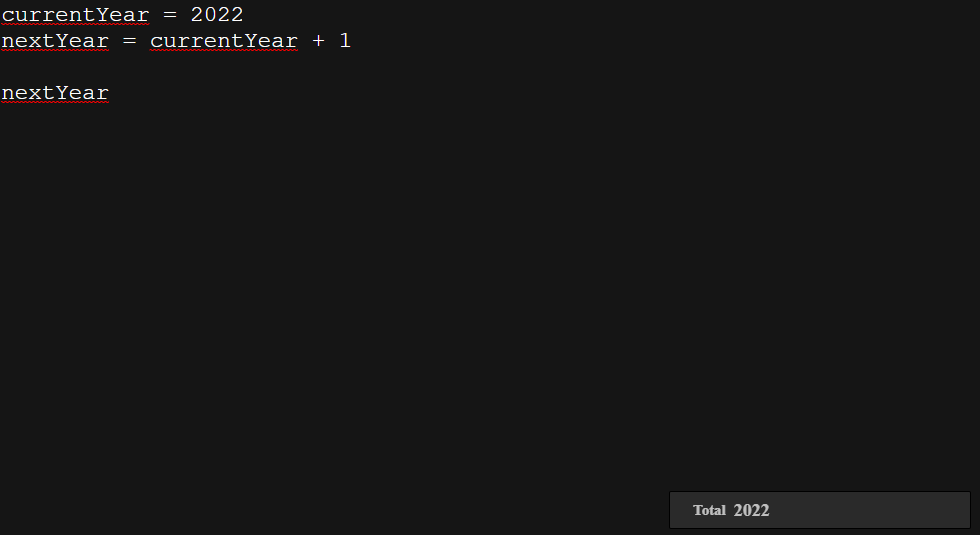

# calctext
A basic minimalist Calculator based on Soulver ✖️

All you have to do it's clone this repository and build it with yarn or npm.

<p align="center">
  
</p>

## Build

```javascript
yarn build
```
or
```javascript
npm build
```

## Dev
If you want to upgrade or fix something you can open an issue or clone this repository and call yarn dev to try to fix by yourself.


```javascript
yarn dev
```
or
```javascript
npm dev
```

## Author

Paulo Henrique - @paulohenriquesn
